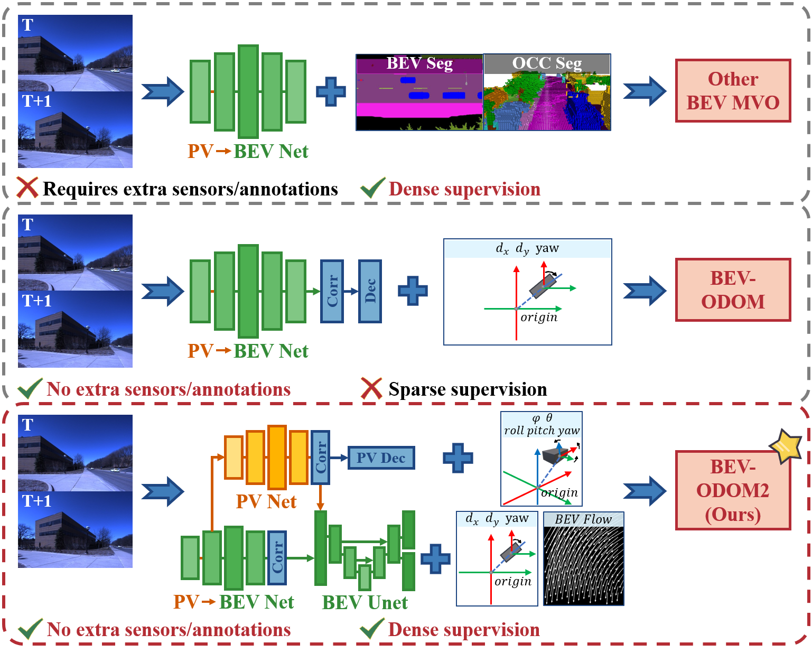
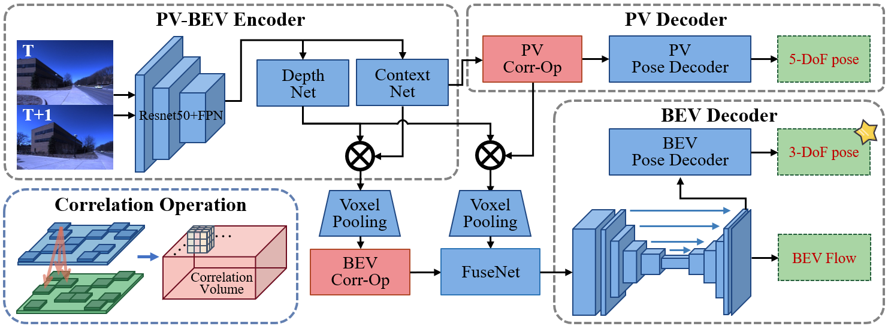
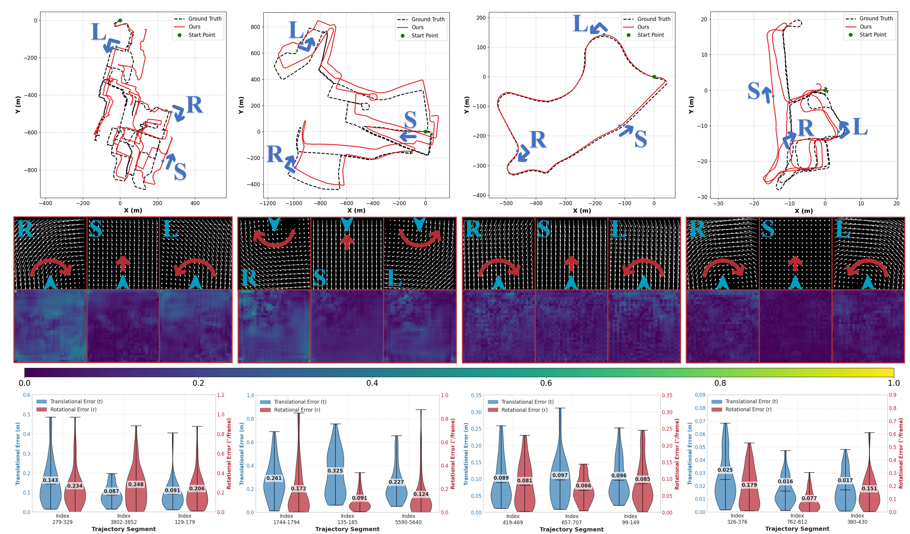
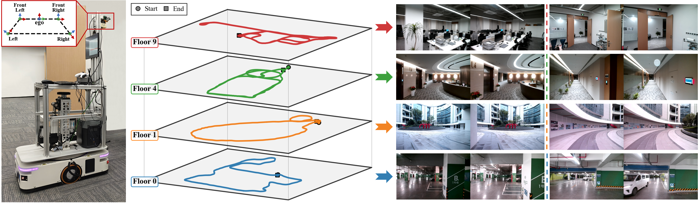

# BEV-ODOM2

**BEV-ODOM2: Enhanced BEV-based Monocular Visual Odometry with PV-BEV Fusion and Dense Flow Supervision for Ground Robots**

English | [中文](README_CN.md)

[](https://arxiv.org/)
[](https://github.com/WeiYuFei0217/BEV-ODOM2)
[](https://github.com/WeiYuFei0217/ZJH-VO-Dataset/)

## Table of Contents

- [Introduction](#introduction)
  - [Framework](#framework)
  - [Case Study](#case-study)
  - [Visualizations](#visualizations)
- [Environment Setup](#environment-setup)
- [Dataset Preparation](#dataset-preparation)
- [Training](#training)
- [Testing](#testing)
- [Pre-trained Models](#pre-trained-models)
- [Citation](#citation)
- [Acknowledgements](#acknowledgements)

## Introduction

<p align="center">
  
</p>
<p align="center"><i>Comparison of BEV-based monocular visual odometry approaches. Previous BEV MVO methods require extra sensors/annotations for dense supervision, while BEV-ODOM uses only sparse pose labels. BEV-ODOM2 (Ours) achieves dense supervision without extra annotations through PV-BEV dual-branch fusion and BEV optical flow.</i></p>

Bird's-Eye-View (BEV) representation offers a metric-scaled planar workspace, facilitating the simplification of 6-DoF ego-motion to a more robust 3-DoF model for monocular visual odometry (MVO) in intelligent transportation systems. However, existing BEV methods suffer from **sparse supervision signals** and **information loss** during perspective-to-BEV projection.

**BEV-ODOM2** is an enhanced framework addressing both limitations without additional annotations. Our approach introduces:

1. **Dense BEV Optical Flow Supervision** — constructs pixel-level flow ground truth directly from 3-DoF pose transformations, providing dense correspondence guidance using only existing pose data.
2. **PV-BEV Dual-Branch Fusion** — computes correlation volumes in perspective view (PV) before LSS projection to preserve 6-DoF motion cues, then fuses them with BEV-native correlation features for comprehensive motion understanding.
3. **Enhanced Rotation Sampling** — targets dataset biases toward straight-line driving by probabilistically balancing high-rotation and standard-rotation training pairs.

The framework employs three supervision levels derived solely from pose data: dense BEV flow, 5-DoF for the PV branch, and 3-DoF for the final output. Extensive evaluation on **KITTI**, **NCLT**, **Oxford RobotCar**, and our newly collected **ZJH-VO** multi-scale dataset demonstrates state-of-the-art performance, achieving **40% improvement in RTE** compared to previous BEV methods.

### Framework

<p align="center">
  
</p>
<p align="center"><i>Overview of the proposed BEV-ODOM2 framework, including the PV-BEV encoder with shared feature extraction, PV correlation branch for 5-DoF supervision, BEV correlation with dense flow prediction via FlowUNet, and final 3-DoF pose regression.</i></p>

### Case Study

<p align="center">
  
</p>
<p align="center"><i>Case study showing predicted trajectories, dense BEV optical flow fields, and error analysis for representative straight (S), left-turn (L), and right-turn (R) maneuvers across NCLT, Oxford, KITTI, and ZJH-VO datasets.</i></p>

### Visualizations

<p align="center">
  
</p>
<p align="center"><i>Trajectory and Dense BEV Flow Visualization on NCLT and Oxford RobotCar datasets.</i></p>

<p align="center">
  
</p>
<p align="center"><i>Trajectory and Dense BEV Flow Visualization on KITTI and ZJH-VO datasets.</i></p>

## Environment Setup

### Prerequisites
- CUDA 11.6
- Python 3.9.18
- PyTorch 1.13.0

### Installation

1. Create and activate a conda environment:
```bash
conda create -n bevodom2 python=3.9.18
conda activate bevodom2
```

2. Install dependencies (execute one by one in order):
```bash
cd ./BEV-ODOM2/
pip install "pip<24.1"
pip install torch==1.13.0+cu116 torchvision==0.14.0+cu116 torchaudio==0.13.0 --extra-index-url https://download.pytorch.org/whl/cu116
pip install -r requirements.txt
pip install torch==1.13.0+cu116 torchvision==0.14.0+cu116 torchaudio==0.13.0 --extra-index-url https://download.pytorch.org/whl/cu116
pip uninstall torchmetrics
python setup.py develop
pip install --upgrade networkx
pip install transforms3d
pip install --upgrade pip
pip install spatial-correlation-sampler==0.4.0
```

## Dataset Preparation

BEV-ODOM2 is evaluated on the following datasets:

| Dataset | Cameras | Description |
|---------|---------|-------------|
| [NCLT](http://robots.engin.umich.edu/nclt/) | 5 (mono: front camera) | University of Michigan North Campus long-term dataset with vehicle jitter, illumination changes, and seasonal variations |
| [Oxford RobotCar](https://robotcar-dataset.robots.ox.ac.uk/) | 3 (mono: rear camera) | Complex urban driving with varying traffic density and dynamic objects |
| [KITTI](http://www.cvlibs.net/datasets/kitti/eval_odometry.php) | 1 | Standard autonomous driving benchmark with elevation changes |
| [ZJH-VO](https://github.com/WeiYuFei0217/ZJH-VO-Dataset/) | 4 (mono: front-left camera) | Our newly collected multi-scene, multi-scale dataset covering underground parking, outdoor plaza, corridors, and offices |

<p align="center">
  
</p>
<p align="center"><i>Overview of the ZJH-VO dataset: data collection platform (left), multi-floor trajectories (center), and representative scenes including offices, corridors, outdoor plazas, and underground parking (right).</i></p>

### Directory Structure

Please organize your datasets as follows, and update the corresponding paths in your config file (see [Training](#training)):

```
<your_data_root>/
├── NCLT/
│   └── format_data/
│       ├── 2013-04-05/
│       │   ├── lb3_u_s_384/
│       │   └── ground_truth/
│       ├── 2012-01-08/
│       ├── ...
│       └── image_meta.pkl
├── oxford/
│   ├── 2019-01-11-13-24-51/
│   ├── 2019-01-14-14-15-12/
│   ├── ...
│   └── image_meta.pkl
├── kitti/
│   ├── 00/
│   ├── 01/
│   ├── ...
│   └── 10/
└── ZJH/
    └── bag_data/
```

## Training

1. **Configure dataset paths**: Open the desired config file in `bevodom2/config_files/` and update the dataset paths:

```yaml
# In bevodom2/config_files/NCLT.yaml (or Oxford.yaml)
training_params:
  data_root_nclt: "/your/path/to/NCLT/format_data"
  data_root_oxford: "/your/path/to/oxford"
```

2. **(Optional) Set up TensorBoard for monitoring**:
```bash
tensorboard --logdir=./bevodom2/outputs/ --samples_per_plugin=images=100
```

3. **Start training**:
```bash
cd ./BEV-ODOM2/bevodom2/train_model/
python train.py --config=../config_files/NCLT.yaml --gpu=0
```

Available config files:
- `NCLT.yaml` — NCLT dataset
- `Oxford.yaml` — Oxford RobotCar dataset

Multi-GPU training is supported:
```bash
python train.py --config=../config_files/NCLT.yaml --gpu=0,1,2
```

## Testing

1. **Configure checkpoint path** in the config file:
```yaml
training_params:
  JUST_TEST: true
  ckpt_path: "/path/to/your/checkpoint.pth"
```

2. **Run evaluation**:
```bash
cd ./BEV-ODOM2/bevodom2/train_model/
python train.py --config=../config_files/NCLT.yaml --gpu=0
```

## Pre-trained Models

We provide both the pre-trained backbone models and the final trained models for NCLT and Oxford datasets.

All model files can be downloaded from: [Baidu Cloud](https://pan.baidu.com/s/1bENj0eRTGMiYw5hnZB15Dw?pwd=ODOM) (extraction code: `ODOM`)

| Dataset | BEVDepth Pre-trained Weights | Final Model |
|---------|------------------------------|-------------|
| NCLT | ✅ Included | ✅ Included |
| Oxford | ✅ Included | ✅ Included |

## Citation

If you find this work useful, please consider citing:

```bibtex
@article{wei2025bevodom2,
  title={BEV-ODOM2: Enhanced BEV-based Monocular Visual Odometry with PV-BEV Fusion and Dense Flow Supervision for Ground Robots},
  author={Wei, Yufei and Lu, Wangtao and Lu, Sha and Hu, Chenxiao and Han, Fuzhang and Xiong, Rong and Wang, Yue},
  journal={IEEE Transactions on Intelligent Transportation Systems},
  year={2025}
}
```

## Acknowledgements

This project builds upon several excellent open-source works, including [BEVDepth](https://github.com/Megvii-BaseDetection/BEVDepth), [MMDetection3D](https://github.com/open-mmlab/mmdetection3d), and [spatial-correlation-sampler](https://github.com/ClementPinard/Pytorch-Correlation-extension). We also thank the creators of the [NCLT](http://robots.engin.umich.edu/nclt/), [Oxford RobotCar](https://robotcar-dataset.robots.ox.ac.uk/), and [KITTI](http://www.cvlibs.net/datasets/kitti/) datasets.

## License

This project is released under the [MIT License](LICENSE).
