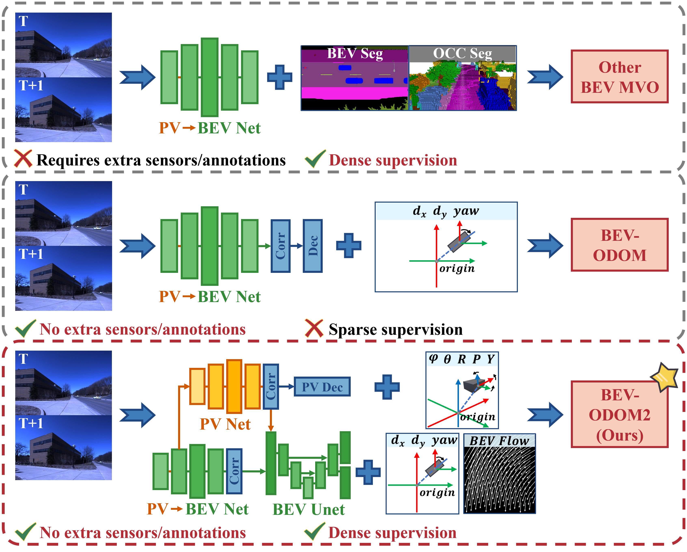
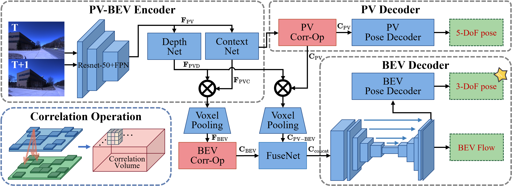

# BEV-ODOM2

**BEV-ODOM2: Enhanced BEV-based Monocular Visual Odometry with PV-BEV Fusion and Dense Flow Supervision for Ground Robots**

## Contents

- [Introduction](#introduction)
- [Installation](#installation)
- [Data Preparation](#data-preparation)
- [Training](#training)
- [Testing](#testing)
- [Results](#results)
- [Model Weights](#model-weights)
- [Implementation Notes](#implementation-notes)
- [Acknowledgements](#acknowledgements)
- [License](#license)

## Introduction

<p align="center">
  
</p>
<p align="center"><i>Comparison of BEV-based monocular odometry methods. Unlike prior approaches needing extra annotations or limited by sparse supervision, BEV-ODOM2 leverages PV-BEV fusion and dense rigid BEV flow to provide rich supervision from pose data alone.</i></p>

Bird's-Eye-View (BEV) representation addresses the scale drift problem of monocular visual odometry (MVO) by providing a metric-scaled planar workspace, which allows 6-DoF ego-motion to be simplified to a more robust 3-DoF model. Existing BEV-based methods, however, suffer from sparse supervision signals from pose-only training and from information loss during perspective-to-BEV projection. BEV-ODOM2 addresses both limitations without supervision modalities beyond the pose ground truth:

1. **Pose-derived dense rigid BEV flow supervision** reparameterizes the 3-DoF pose ground truth into a pixel-level training signal.
2. **Perspective View (PV)-BEV fusion** computes correlation volumes before projection to retain additional motion cues and help alleviate projection ambiguity. The PV branch is supervised by an auxiliary 5-DoF pose objective.
3. **Enhanced rotation sampling** balances diverse motion patterns during training.

In the paper, BEV-ODOM2 reduces the RTE of BEV-ODOM by 39% on average across four datasets.

<p align="center">
  
</p>
<p align="center"><i>Overview of the BEV-ODOM2 framework. The PV-BEV Encoder shares a ResNet-50+FPN backbone and projects both PV features and PV correlation volumes into BEV space via LSS. The PV Decoder regresses a 5-DoF pose from PV correlations. The BEV Decoder fuses projected PV and BEV-native correlations to jointly predict the dense rigid BEV flow and the final 3-DoF pose.</i></p>

<p align="center">
  
</p>
<p align="center"><i>Trajectory and dense rigid BEV flow visualization on NCLT and Oxford.</i></p>

## Installation

Requirements: Python 3.9, PyTorch 1.13.0, CUDA 11.6 and one GPU.

```bash
conda create -n bevodom2 python=3.9.18
conda activate bevodom2

pip install "pip<24.1"
pip install torch==1.13.0+cu116 torchvision==0.14.0+cu116 torchaudio==0.13.0 --extra-index-url https://download.pytorch.org/whl/cu116
pip install -r requirements.txt
# re-install the CUDA 11.6 build of PyTorch in case a dependency replaced it
pip install torch==1.13.0+cu116 torchvision==0.14.0+cu116 torchaudio==0.13.0 --extra-index-url https://download.pytorch.org/whl/cu116
pip install --upgrade networkx
pip install spatial-correlation-sampler==0.4.0

# build the voxel pooling CUDA operator
python setup.py develop
```

All commands below are run from the repository root.

## Data Preparation

Download [NCLT](http://robots.engin.umich.edu/nclt/) and [Oxford Radar RobotCar](https://oxford-robotics-institute.github.io/radar-robotcar-dataset/) and organize them as follows. Only one monocular camera is used per dataset (NCLT: Cam5; Oxford: mono rear).

```
<NCLT data_root>/
├── image_meta.pkl
├── 2012-01-08/
│   ├── lb3_u_s_384/
│   │   ├── Cam1/<timestamp>.jpg        # file names define the frame order
│   │   └── Cam5/<timestamp>.jpg
│   └── ground_truth/groundtruth_2012-01-08.csv   # groundtruth_<date>.csv directly in <date>/ is also accepted
├── 2012-02-02/
└── ...

<Oxford data_root>/
├── image_meta.pkl
├── 2019-01-11-12-26-55/
│   ├── velodyne_left/<timestamp>.bin   # timestamps define the frames
│   ├── mono_rear_rect/<timestamp>.png
│   ├── mono_rear.timestamps
│   └── gps/ins.csv
└── ...
```

`image_meta.pkl` is a pickled dict with the camera intrinsics `'K'` and the camera-from-body extrinsics `'T'` (4×4) of each camera. NCLT uses the last entry; Oxford uses the third entry.

Edit the path keys at the top of `bevodom2/config_files/NCLT.yaml` and `bevodom2/config_files/Oxford.yaml`:

| Key | Meaning |
|---|---|
| `data_root` | dataset root shown above |
| `pair_root` | output directory of the training pair lists (default `./pairs/<dataset>`) |
| `output_root` | logs, checkpoints and trajectories (default `./outputs`) |

### Sequence splits

| Dataset | Train | Validation | Test |
|---|---|---|---|
| NCLT | 2013-04-05, 2012-01-08, 2012-02-04 | 2012-05-26 | 2012-02-02, 2012-02-19, 2012-03-17, 2012-08-20 |
| Oxford | 2019-01-11-13-24-51, 2019-01-14-14-15-12, 2019-01-15-14-24-38 | 2019-01-11-14-02-26, 2019-01-15-13-53-14, 2019-01-16-13-42-28, 2019-01-17-13-26-39 | 2019-01-11-12-26-55, 2019-01-15-13-06-37, 2019-01-16-14-15-33, 2019-01-17-12-48-25 |

### Training pair lists

Enhanced rotation sampling draws training pairs from pre-computed lists. Generate them once per dataset:

```bash
python tools/gen_pairs.py -c bevodom2/config_files/NCLT.yaml
python tools/gen_pairs.py -c bevodom2/config_files/Oxford.yaml
```

The lists are written to `<pair_root>/<sequence>/<pair_file>`. The sampling parameters (`pair_window_s`, `pair_max_dist`, `pair_high_rot_deg`) are set in `train_conf` of the yaml. Optional arguments: `--sequences` (default: `train_sequences`), `--out_root` (default: `pair_root`), `--overwrite`.

## Training

Place the backbone initialization files in `pretrained/` (see [Model Weights](#model-weights)), then run:

```bash
python bevodom2/train_model/train.py -c bevodom2/config_files/NCLT.yaml -g 0
python bevodom2/train_model/train.py -c bevodom2/config_files/Oxford.yaml -g 0
```

- Training runs for 100 epochs with Adam (learning rate 1e-4, decayed by 0.95 per epoch) and a batch size of 16 on a single GPU (`-g` takes one GPU ID).
- After every epoch, the model is evaluated on the validation sequences. The epoch with the lowest RTE averaged over the validation sequences is saved as `best.pth`.
- When training finishes, `best.pth` is evaluated once on the test sequences.
- To resume an interrupted run, pass its run name (`<YYMMDD_HHMMSS>_<dataset>`): `--resume 260101_120000_NCLT`.

Outputs in `output_root`:

```
outputs/
├── log_<run>/                     # TensorBoard logs and loss_record.txt
├── model_save/model_<run>/        # best.pth, last.pth, val_metrics.csv
└── evo/                           # TUM-format trajectories (ground truth and prediction)
```

Monitor training with `tensorboard --logdir outputs/`.

## Testing

```bash
python bevodom2/train_model/train.py -c bevodom2/config_files/NCLT.yaml -g 0 --test --weights weights/bevodom2_nclt.pth
python bevodom2/train_model/train.py -c bevodom2/config_files/Oxford.yaml -g 0 --test --weights weights/bevodom2_oxford.pth
```

The script prints RTE (%), RRE (°/100 m) and ATE (m, after SE(3) and Sim(3) alignment) for each test sequence and their averages. Add `--split val` to evaluate on the validation sequences. Weights are loaded with `strict=True`.

## Results

Test results of BEV-ODOM2 in the paper (RTE in %, RRE in °/100 m, SE(3) alignment):

| Dataset | Metric | Seq 1 | Seq 2 | Seq 3 | Seq 4 | Average |
|---|---|---|---|---|---|---|
| NCLT (02-02 / 02-19 / 03-17 / 08-20) | RTE | 5.30 | 4.03 | 3.66 | 5.75 | **4.68** |
| | RRE | 2.70 | 1.62 | 1.71 | 2.72 | **2.19** |
| Oxford (11-12 / 15-13 / 16-14 / 17-12) | RTE | 3.38 | 3.24 | 7.98 | 4.76 | **4.84** |
| | RRE | 0.82 | 0.87 | 0.99 | 1.33 | **1.00** |

The average ATE after Sim(3) alignment is 65.75 m on NCLT and 71.34 m on Oxford.

RTE and RRE are averaged over all sub-trajectories of 100, 200, ..., 800 m; ATE is the mean position error after a single global alignment of the full sequence. The voxel pooling CUDA operator accumulates with atomic additions, so repeated evaluations differ slightly (on the order of 1e-4 in the per-sequence RTE) and a per-sequence value may round differently in the last digit.

## Model Weights

Download the files and place them as listed. Checksums are also provided in `weights/SHA256SUMS` and `pretrained/SHA256SUMS`.

- Baidu Netdisk: [download](https://pan.baidu.com/s/1bENj0eRTGMiYw5hnZB15Dw?pwd=ODOM) (extraction code: `ODOM`)

| File | SHA256 |
|---|---|
| `weights/bevodom2_nclt.pth` | `334a66205df03c0c883816448727a16af7e91c0247d60473280bc7229964c1f9` |
| `weights/bevodom2_oxford.pth` | `80c49f250c256251d317e9afe69b88eb08d2aaf62a97592063abe3b62b2c144a` |
| `pretrained/bevodom2_nclt_init.pth` | `71eed027b6277b5528379654b1bcb70f6d7beeb7369ac0e62e6e8e503698e97e` |
| `pretrained/bevodom2_oxford_init.pth` | `bc2331d3b3abc404c0f26c13cd1dc594f6ecc930155bbfd0cb65199c6d9b5c4f` |

`weights/` holds the trained models (selected on the validation sequences) used for [Testing](#testing); `pretrained/` holds the initialization files used for [Training](#training). Verify the downloads with:

```bash
(cd weights && sha256sum -c SHA256SUMS) && (cd pretrained && sha256sum -c SHA256SUMS)
```

## Implementation Notes

- BEV grid: 128 × 128 cells of 0.8 m. The BEV correlation is computed on the 64 × 64 region of the grid in front of the camera; the dense rigid BEV flow is predicted and supervised on the 32 × 32 region closest to the vehicle, and the 3-DoF pose is regressed from the same region.
- Optimizer: Adam with weight decay 1e-4.
- Validation and test sequences are evaluated on every 5th frame (`eval_conf.frame_stride`).
- Model, loss and training settings are listed in the yaml files (`backbone_conf`, `model_conf`, `train_conf`, `eval_conf`).
- The ablation variants reported in the paper are not included in this release.

## Acknowledgements

This project builds upon [BEVDepth](https://github.com/Megvii-BaseDetection/BEVDepth), [MMDetection3D](https://github.com/open-mmlab/mmdetection3d) and [spatial-correlation-sampler](https://github.com/ClementPinard/Pytorch-Correlation-extension). We thank the creators of the [NCLT](http://robots.engin.umich.edu/nclt/) and [Oxford Radar RobotCar](https://oxford-robotics-institute.github.io/radar-robotcar-dataset/) datasets.

## License

This project is released under the [MIT License](LICENSE).
